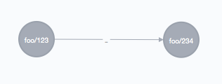
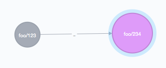

### API

Standard answer of this form.

	{
	    "data": ...,
	    "duration_ms": 28.084491,
	    "duration_seconds": 0.028084491,
	    "ok": true
	}

Basic path form

	/:dataset/:type/:id
	/:dataset/:type

Parameters `s`,`t`,`id`.

### Basic overview

Create edge

	http POST :5000/foo/LIES_IN source:=1 target:=2 doc:='{"a":123}'

Create node with id `foo/999`.

	http POST :5000/foo/PIT/999 doc:='{"hey":"there"}'

Look it up in Neo using `id` index.

	http GET :5000/query/get-node-by-id id="foo/999"

Find adjecent edges

	http GET :5000/query/get-adjecent id="foo/999"

### Example

Clean database

	jelle@joule ~/r/e/newcore> http :5000//query/clean
	HTTP/1.1 200 OK
	Connection: keep-alive
	Content-Type: application/json
	Date: Mon, 15 Jun 2015 19:31:54 GMT
	Transfer-Encoding: chunked

	{
	    "data": [
		{
		    "true": true
		},
		{
		    "true": true
		},
		{
		    "true": true
		},
		{
		    "true": true
		}
	    ],
	    "duration_ms": 174.553212,
	    "duration_seconds": 0.174553212,
	    "ok": true
	}

Create dangling edge

	jelle@joule ~/r/e/newcore>
	http POST :5000/foo/LIES_IN s='foo/123' t='foo/234' doc:='{"bert":true}'
	HTTP/1.1 200 OK
	Connection: keep-alive
	Content-Type: application/json
	Date: Mon, 15 Jun 2015 19:31:58 GMT
	Transfer-Encoding: chunked

	{
	    "data": [
		{
		    "_id": "foo/DVrBUdsnDY9VYYi+JRQ4vSrx+ySSPNyA0xkUWw==",
		    "_index": "foo",
		    "_type": "LIES_IN",
		    "_version": 10,
		    "created": false
		},
		[
		    {
			"e": {
			    "_fromId": 63,
			    "_id": 18,
			    "_toId": 64,
			    "properties": {
				"bert": true,
				"id": "foo/DVrBUdsnDY9VYYi+JRQ4vSrx+ySSPNyA0xkUWw=="
			    },
			    "type": "_"
			},
			"s": {
			    "_id": 63,
			    "labels": [
				"_",
				"_VACANT"
			    ],
			    "properties": {
				"id": "foo/123"
			    }
			},
			"t": {
			    "_id": 64,
			    "labels": [
				"_",
				"_VACANT"
			    ],
			    "properties": {
				"id": "foo/234"
			    }
			}
		    }
		]
	    ],
	    "duration_ms": 184.722759,
	    "duration_seconds": 0.184722759,
	    "ok": true
	}

Get the vacant node directly from Neo4J.

	jelle@joule ~/r/e/newcore> http GET :5000//query/get-node id="foo/123"
	HTTP/1.1 200 OK
	Connection: keep-alive
	Content-Type: application/json
	Date: Mon, 15 Jun 2015 19:32:13 GMT
	Transfer-Encoding: chunked

	{
	    "data": [
		{
		    "n": {
			"_id": 63,
			"labels": [
			    "_",
			    "_VACANT"
			],
			"properties": {
			    "id": "foo/123"
			}
		    }
		}
	    ],
	    "duration_ms": 28.084491,
	    "duration_seconds": 0.028084491,
	    "ok": true
	}

POST `PIT` document, creates a node.

	jelle@joule ~/r/e/newcore> http POST :5000/foo/PIT/234 doc:='{"boter":"eieren"}'
	HTTP/1.1 200 OK
	Connection: keep-alive
	Content-Type: application/json
	Date: Mon, 15 Jun 2015 19:32:22 GMT
	Transfer-Encoding: chunked

	{
	    "data": [
		{
		    "_id": "foo/234",
		    "_index": "foo",
		    "_type": "PIT",
		    "_version": 5,
		    "created": false
		},
		[
		    {
			"n": {
			    "_id": 64,
			    "labels": [
				"_"
			    ],
			    "properties": {
				"accessTime": 1434396742724,
				"boter": "eieren",
				"counter": 1,
				"id": "foo/234"
			    }
			}
		    }
		]
	    ],
	    "duration_ms": 129.878751,
	    "duration_seconds": 0.129878751,
	    "ok": true
	}

Notice `:_VACANT` label is gone.

	jelle@joule ~/r/e/newcore> http GET :5000//query/get-node id="foo/234"
	HTTP/1.1 200 OK
	Connection: keep-alive
	Content-Type: application/json
	Date: Mon, 15 Jun 2015 19:43:09 GMT
	Transfer-Encoding: chunked

	{
	    "data": [
		{
		    "n": {
			"_id": 64,
			"labels": [
			    "_"
			],
			"properties": {
			    "accessTime": 1434396742724,
			    "boter": "eieren",
			    "counter": 1,
			    "id": "foo/234"
			}
		    }
		}
	    ],
	    "duration_ms": 61.331997,
	    "duration_seconds": 0.061331997,
	    "ok": true
	}

