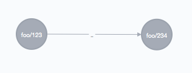

some sort of graphmalizer, take sets of documents into elasticsearch and neo.

see [ABOUT](docs/ABOUT.md)


One adds node and edges willy nilly, graphmalizer will stitch your id's together.



adding a node to the source or target idea will update the vacant node:


the interface is 'document' oriented, you pass a document to `/:dataset/:type(/:id)`.
And depending on the document *type* you pass `id`, `source` and `target`
(as parameters).


define your types here [`config.json`](config.json)

```js
{
	"types": {
		"PIT": {
			"node": {}
		},
		"LIES_IN": {
			"edge": {}
		},
		"SAME_AS": {
			"edge": {}
		},
		"USED_FOR": {
			"edge": {}
		},
		"ORIGINATED_FROM": {
			"edge": {}
		}
	}
}
```

(or pass file path as `--config` or as `GRAPHMALIZER_CONFIG` environment variable)


then you can test the server using HTTPie

	pip install httpie
	node server.js

create an edge, automatic id

	http POST :5000/foo/LIES_IN/ source:=1 target:=2 doc:='{"hi":123}'

create a node

	http POST :5000/foo/PIT/123 doc:='{"some":["prop",123]}'

# running

Development, fish shell

	nodemon -w (echo *.js *.cypher) server.js

### config file

specify config file using

- environment var `GRAPHMALIZER_CONFIG`
- commandline argument `--config`
- or by placing `config.json` in the startup directory

### Alternatives / related work

Some related things,

- csv import https://github.com/jexp/neo4j-shell-tools
- another importer https://github.com/jexp/neo4j-dataset-import
- streaming cypher plugin https://github.com/neo4j-contrib/streaming-cypher
- define fixed cypher endpoints https://github.com/jexp/cypher-rs
- run cypher queries inside gremlin
  [code](https://github.com/scholrly/neo4django/blob/master/neo4django/gremlin/library.groovy#L19)

