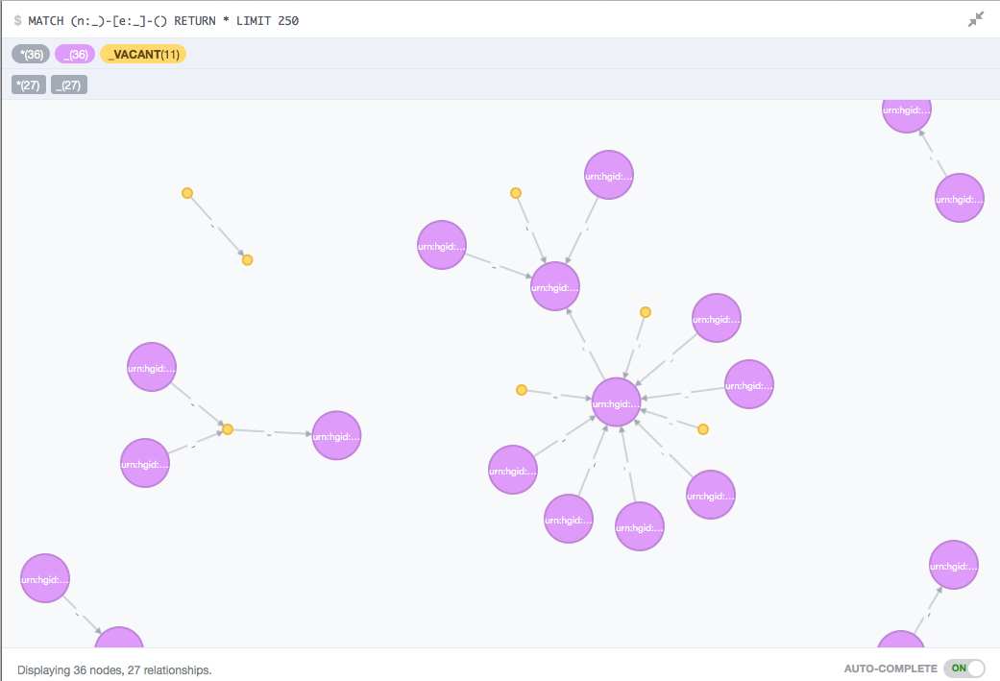

some sort of graphmalizer, take sets of documents into elasticsearch and neo.

see [ABOUT](ABOUT.md)

define your types here [typedefs](conf/typedefs.js)

	PIT: { node: {} },
	LIES_IN: { edge: { source: 'from', target: 'to' } }

then you can test the server using HTTPie

	pip install httpie
	node server.js

create an edge, automatic id

	http POST :5000/foo/LIES_IN/ source:=1 target:=2 doc:='{"hi":123}'

create a node

	http POST :5000/foo/PIT/123 doc:='{"some":["prop",123]}'

# running

Development, fish shell

	nodemon -w (echo *.js *.cypher) server.js
