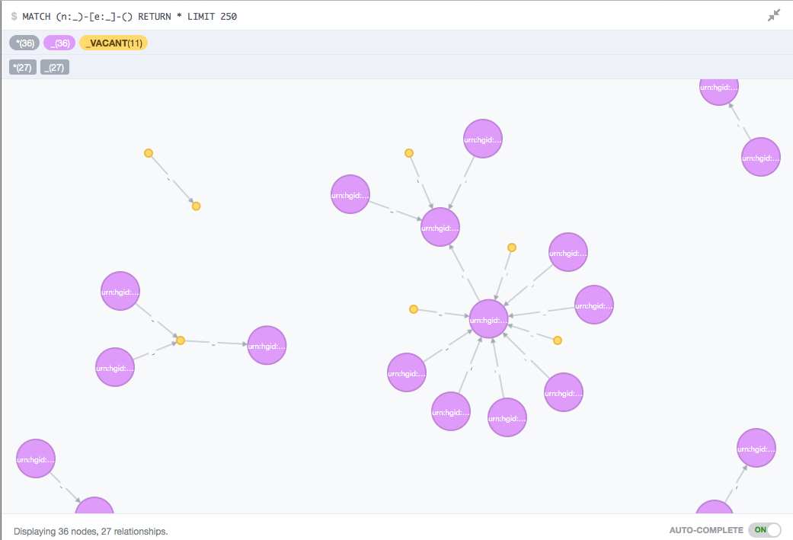

some sort of graphmalizer, take sets of documents into elasticsearch and neo.

see [ABOUT](ABOUT.md)



define your types here [`config.json`](config.json)

```js
{
	"types": {
		"PIT": {
			"node": {}
		},
		"LIES_IN": {
			"edge": {}
		},
		"SAME_AS": {
			"edge": {}
		},
		"USED_FOR": {
			"edge": {}
		},
		"ORIGINATED_FROM": {
			"edge": {}
		}
	}
}
```

(or pass file path as `--config` or as `GRAPHMALIZER_CONFIG` environment variable)


then you can test the server using HTTPie

	pip install httpie
	node server.js

create an edge, automatic id

	http POST :5000/foo/LIES_IN/ source:=1 target:=2 doc:='{"hi":123}'

create a node

	http POST :5000/foo/PIT/123 doc:='{"some":["prop",123]}'

# running

Development, fish shell

	nodemon -w (echo *.js *.cypher) server.js

### config file

specify config file using

- environment var `GRAPHMALIZER_CONFIG`
- commandline argument `--config`
- or by placing `config.json` in the startup directory

